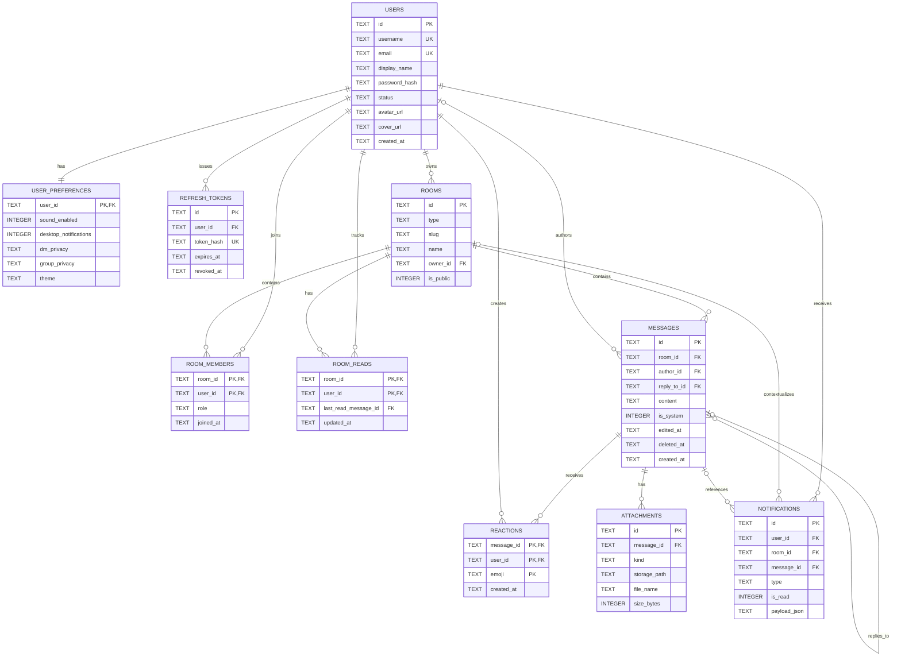

# CentrumChat — Historical Database Review

> Historical design review — not current implementation. It describes the pre-migration
> `rooms`/`refresh_tokens` schema and former database path. Current truth is `db/migrations/`,
> `src/storage/db.ts`, and production repositories.

## 1. Executive summary

This is a current-state map of the database and its database-facing code. It is not a
redesign proposal and no schema or production source was changed for this review.

The project uses one SQLite database through Deno 2's built-in `node:sqlite`-
`DatabaseSync`. The authoritative schema is three numbered migrations under
`db/migrations/`; the migration runner is `src/storage/db.ts`. The schema has 11 tables:
`users`, `rooms`, `messages`, `room_members`, `room_reads`, `reactions`, `attachments`,
`notifications`, `user_preferences`, `refresh_tokens`, and `schema_migrations`.

The core model is deliberately unified: channels, groups, and direct-message rooms share
`rooms`, with `rooms.type` selecting the behavior. Group and DM access is represented by
`room_members`; ordinary channel access is application-defined and does not require a
membership row. Messages, replies, reactions, attachments, notifications, and read state
are separate tables with foreign keys and selected cascade behavior.

The strongest integrity guarantees are primary/unique keys, foreign keys enabled at open,
the composite uniqueness of memberships/reactions/read state, and message pagination
using `(created_at, rowid)`. The largest current risks are application-only DM pair
uniqueness, multi-step workflows without an encompassing transaction, missing database
checks for several enum-like fields, lack of cleanup for expired refresh tokens, and
profile counters that exist in the schema but are not updated by the observed message or
reaction services.

The checked-in SQLite file exists at `data/centrumchat.sqlite`. A read-only inspection on
the review date found 2 users, 5 rooms, 15 messages, 2 room-membership rows, 4 read-state
rows, 2 reactions, 1 attachment, 10 notifications, 2 preference rows, 29 refresh-token
rows, and 3 applied migrations. These counts are an environment snapshot, not schema
requirements. The migration files and source code remain authoritative.

## 2. Database runtime overview

### Engine and location

- Engine: SQLite via Deno 2's `node:sqlite` `DatabaseSync` (`src/storage/db.ts:1-9`).
- Configured path: `DATABASE_PATH`, default `./data/centrumchat.sqlite`
  (`src/shared/config/config.ts:1-54`, `.env.example:8-9`).
- The production composition root opens the database once and injects the same `Db`
  into all SQLite repositories (`src/main.ts:79-110`).
- The checked-in database has SQLite WAL sidecars (`data/centrumchat.sqlite-wal` and
  `data/centrumchat.sqlite-shm`).

### Connection initialization and pragmas

`openDatabase()` creates the parent directory, opens `DatabaseSync`, and executes:

```sql
PRAGMA journal_mode = WAL;
PRAGMA foreign_keys = ON;
```

There is no configured busy timeout, synchronous setting, cache setting, or explicit
connection pool in `src/storage/db.ts:38-89`. The application uses one shared connection.
SQLite therefore serializes writes at the database level; application code does not add a
separate writer queue.

### Migration mechanism

`src/storage/db.ts:17-36` accepts files matching `^\d{4}_(.+)\.sql$`, sorts by numeric
version, and ignores non-matching files. It creates `schema_migrations` if needed, reads
already applied versions, and runs each pending migration in its own explicit
`BEGIN`/`COMMIT` transaction. A migration failure is rolled back and rethrown. The runner
does not validate that an already-applied migration's file contents are unchanged, and it
does not reject gaps or duplicate numeric versions beyond normal SQLite primary-key
behavior in `schema_migrations`.

Current migration files:

| Version | File | Effect |
|---:|---|---|
| 0001 | `db/migrations/0001_init.sql` | Creates the core tables, foreign keys, checks, primary keys, unique constraints, and secondary indexes. |
| 0002 | `db/migrations/0002_seed_channels.sql` | Inserts four public channel rows: `general`, `programming`, `technology`, and `gaming`. |
| 0003 | `db/migrations/0003_attachment_kind.sql` | Adds `attachments.kind TEXT NOT NULL DEFAULT 'attachment'`. |

### Transaction mechanism

`withTransaction()` in `src/storage/db.ts:91-104` wraps a synchronous callback in
`BEGIN`/`COMMIT` and rolls back on error. It is used by
`SqlitePreferencesRepository.update()` (`src/storage/repositories/sqlitePreferencesRepository.ts:40-67`).
The migration runner uses equivalent explicit transactions. Most repository writes are
single SQL statements and are not wrapped in a transaction by their service workflow.

### Test database strategy

`tests/support/testDatabase.ts:1-28` creates a fresh temporary directory for each database
test, opens a temporary `test.sqlite` through the real migration runner, and removes the
directory recursively during cleanup. Repository tests use the real SQLite repositories;
unit tests generally use in-memory fake repository implementations. Full integration tests
boot the application against temporary SQLite state, as documented in `README.md` and
`docs/05-folder-structure.md`.

## 3. Complete table inventory

Types below are the declared SQLite types. SQLite does not enforce a separate static type
system in the same way as TypeScript. Boolean-like columns are integer `0/1` values.
Timestamp columns are text values, normally generated by
`strftime('%Y-%m-%dT%H:%M:%fZ','now')`.

### `schema_migrations`

| Field | Type / nullability / default | Key or constraint | Lifecycle / notes |
|---|---|---|---|
| `version` | `INTEGER NOT NULL` by primary-key semantics | Primary key | Migration numeric version. |
| `name` | `TEXT NOT NULL` | None | Parsed migration filename stem. |
| `applied_at` | `TEXT NOT NULL`, current UTC default | None | Written by schema creation when the runner inserts the version. |

Indexes: SQLite primary-key autoindex on `version`. No foreign keys or soft delete.
The table is created by `src/storage/db.ts`, not a numbered migration.

### `users`

| Field | Type / nullability / default | Key or constraint | Lifecycle / notes |
|---|---|---|---|
| `id` | `TEXT NOT NULL` | Primary key | Application-generated UUID-like ID via `crypto.randomUUID()`. |
| `username` | `TEXT NOT NULL` | Unique | Registration route validates `[a-zA-Z0-9_]{3,20}`; database uniqueness is exact SQLite text uniqueness. |
| `display_name` | `TEXT NOT NULL` | None | Profile display name. |
| `email` | `TEXT NOT NULL` | Unique | Registration route validates email syntax and max length 254; database does not normalize case. |
| `password_hash` | `TEXT NOT NULL` | None | Password hash only; never part of client profile. |
| `bio` | `TEXT NOT NULL`, default `''` | None | Profile text. |
| `avatar_seed` | `TEXT NULL` | None | Generated/fallback avatar seed. |
| `avatar_url` | `TEXT NULL` | None | Uploaded avatar URL. |
| `cover_index` | `INTEGER NOT NULL`, default `0` | None | Profile cover variant index. |
| `cover_url` | `TEXT NULL` | None | Uploaded cover URL. |
| `name_color` | `TEXT NULL` | None | Hex format is validated in the WebSocket handler, not by SQLite. |
| `status` | `TEXT NOT NULL`, default `'offline'` | `CHECK` in `online`, `idle`, `dnd`, `offline` | Presence state. |
| `last_seen_at` | `TEXT NULL` | None | Updated on selected presence transitions. |
| `is_premium` | `INTEGER NOT NULL`, default `0` | No boolean check | Profile flag. |
| `messages_sent` | `INTEGER NOT NULL`, default `0` | None | Counter column; no observed write in message service. |
| `reactions_added` | `INTEGER NOT NULL`, default `0` | None | Counter column; no observed write in reaction service. |
| `replies_made` | `INTEGER NOT NULL`, default `0` | None | Counter column; no observed write in message service. |
| `created_at` | `TEXT NOT NULL`, current UTC default | None | Registration time. |
| `updated_at` | `TEXT NOT NULL`, current UTC default | None | Explicitly updated by profile, status, avatar, cover, and password repository methods. |

Indexes: autoindexes for the primary key and the two unique constraints. No explicit
username or email indexes are needed because SQLite creates indexes for the unique keys.
There is no user soft-delete field and no user-delete repository operation.

### `rooms`

| Field | Type / nullability / default | Key or constraint | Lifecycle / notes |
|---|---|---|---|
| `id` | `TEXT NOT NULL` | Primary key | Shared ID for channels, groups, and DMs. |
| `type` | `TEXT NOT NULL` | `CHECK` in `channel`, `group`, `dm` | Polymorphic room discriminator. |
| `slug` | `TEXT NULL` | `UNIQUE(type, slug)` | Used by channels; DM slug is null. SQLite permits multiple nulls. |
| `name` | `TEXT NULL` | None | Group/channel name; DM name is derived from members. |
| `topic` | `TEXT NULL` | None | Channel/topic metadata. |
| `owner_id` | `TEXT NULL` | FK `users(id)` with default `NO ACTION` | Used for group ownership; nullable for seeded public channels and DMs. |
| `is_public` | `INTEGER NOT NULL`, default `0` | No boolean check | Seed channels use `1`; access policy is primarily based on `type`. |
| `created_at` | `TEXT NOT NULL`, current UTC default | None | Room creation time. |

Indexes: autoindexes for primary key and `UNIQUE(type, slug)`. No explicit type, owner, or
membership index exists on `rooms`.

### `messages`

| Field | Type / nullability / default | Key or constraint | Lifecycle / notes |
|---|---|---|---|
| `id` | `TEXT NOT NULL` | Primary key | Application-generated message ID. |
| `room_id` | `TEXT NOT NULL` | FK `rooms(id) ON DELETE CASCADE` | Every message belongs to a room. |
| `author_id` | `TEXT NULL` | FK `users(id)` with default `NO ACTION` | Null for server-generated system messages. |
| `content` | `TEXT NOT NULL` | None | Application max length is 4000. |
| `reply_to_id` | `TEXT NULL` | Self-FK `messages(id) ON DELETE SET NULL` | Application validates that the reply target is in the same room. DB does not. |
| `is_system` | `INTEGER NOT NULL`, default `0` | No boolean check | Server-generated group lifecycle messages use `1`. |
| `edited_at` | `TEXT NULL` | None | Set on content edit. |
| `deleted_at` | `TEXT NULL` | None | Soft-delete timestamp; row remains in history. |
| `created_at` | `TEXT NOT NULL`, current UTC default | None | Used with implicit `rowid` for pagination ordering. |

Indexes: `idx_messages_room_created(room_id, created_at)`,
`idx_messages_reply_to(reply_to_id)`, and primary-key autoindex. The repository's cursor
query additionally uses implicit `rowid` as a tie-breaker.

### `room_members`

| Field | Type / nullability / default | Key or constraint | Lifecycle / notes |
|---|---|---|---|
| `room_id` | `TEXT NOT NULL` | FK `rooms(id) ON DELETE CASCADE` | Membership side of group/DM relationships. |
| `user_id` | `TEXT NOT NULL` | FK `users(id) ON DELETE CASCADE` | Member user. |
| `role` | `TEXT NOT NULL`, default `'member'` | `CHECK` in `owner`, `moderator`, `member` | Group/DM roles and sparse channel moderators. |
| `joined_at` | `TEXT NOT NULL`, current UTC default | None | Used for ownership transfer to the oldest remaining member. |

Primary key `(room_id, user_id)` prevents duplicate membership rows. Explicit index
`idx_room_members_user(user_id)` supports reverse membership lookup. There is no index
whose leading column is only `room_id`; the composite primary key supports room-first
queries.

### `room_reads`

| Field | Type / nullability / default | Key or constraint | Lifecycle / notes |
|---|---|---|---|
| `room_id` | `TEXT NOT NULL` | FK `rooms(id) ON DELETE CASCADE` | Read state works for all room types, including channels. |
| `user_id` | `TEXT NOT NULL` | FK `users(id) ON DELETE CASCADE` | Reader. |
| `last_read_message_id` | `TEXT NULL` | FK `messages(id)` with default `NO ACTION` | Null means no explicit read marker; DB does not require same room. |
| `updated_at` | `TEXT NOT NULL`, no table-level default | None | Repository supplies current UTC on upsert. |

Primary key `(room_id, user_id)` supports one state row per user/room. Explicit index
`idx_room_reads_user(user_id)` supports reverse user lookup. The repository uses
`ON CONFLICT(room_id,user_id) DO UPDATE`.

### `reactions`

| Field | Type / nullability / default | Key or constraint | Lifecycle / notes |
|---|---|---|---|
| `message_id` | `TEXT NOT NULL` | FK `messages(id) ON DELETE CASCADE` | Reacted message. |
| `user_id` | `TEXT NOT NULL` | FK `users(id) ON DELETE CASCADE` | Reacting user. |
| `emoji` | `TEXT NOT NULL` | No database format/length check | Handler limits it to 1–8 characters. |
| `created_at` | `TEXT NOT NULL`, current UTC default | None | Reaction creation time. |

Primary key `(message_id, user_id, emoji)` prevents duplicate identical reactions by one
user. Explicit index `idx_reactions_message(message_id)` supports aggregation by message.

### `attachments`

| Field | Type / nullability / default | Key or constraint | Lifecycle / notes |
|---|---|---|---|
| `id` | `TEXT NOT NULL` | Primary key | Also becomes `/media/:id`. |
| `message_id` | `TEXT NULL` | FK `messages(id) ON DELETE CASCADE` | Null while an ordinary upload is waiting to be attached; avatar/cover rows remain null. |
| `file_name` | `TEXT NOT NULL` | None | Original upload filename. |
| `mime_type` | `TEXT NOT NULL` | None | Upload MIME metadata. |
| `size_bytes` | `INTEGER NOT NULL` | None | Size metadata; route enforces configured maximum. |
| `storage_path` | `TEXT NOT NULL` | None | Relative path under configured media root. |
| `created_at` | `TEXT NOT NULL`, current UTC default | None | Upload time and orphan cutoff. |
| `kind` | `TEXT NOT NULL`, default `'attachment'` | No database check | Application union: `attachment`, `avatar`, `cover`; added by migration 0003. |

Indexes: primary-key autoindex and `idx_attachments_message(message_id)`. There is no
index on `(kind, message_id, created_at)`, although the orphan query filters all three
fields.

### `notifications`

| Field | Type / nullability / default | Key or constraint | Lifecycle / notes |
|---|---|---|---|
| `id` | `TEXT NOT NULL` | Primary key | Repository generates UUID. |
| `user_id` | `TEXT NOT NULL` | FK `users(id) ON DELETE CASCADE` | Notification owner. |
| `type` | `TEXT NOT NULL` | No database check | Application values: mention, dm, group_invite, reaction. |
| `room_id` | `TEXT NULL` | FK `rooms(id) ON DELETE CASCADE` | Optional room context. |
| `message_id` | `TEXT NULL` | FK `messages(id) ON DELETE CASCADE` | Optional message context. |
| `payload_json` | `TEXT NULL` | None | Present in schema but omitted from repository row mapping and writes. |
| `is_read` | `INTEGER NOT NULL`, default `0` | No boolean check | Read state. |
| `created_at` | `TEXT NOT NULL`, current UTC default | None | List ordering uses created time and rowid. |

Indexes: primary-key autoindex and `idx_notifications_user_unread(user_id, is_read)`.
There is no explicit created-at index for per-user newest-first retrieval.

### `user_preferences`

| Field | Type / nullability / default | Key or constraint | Lifecycle / notes |
|---|---|---|---|
| `user_id` | `TEXT NOT NULL` | Primary key and FK `users(id) ON DELETE CASCADE` | One-to-one lazy-created preference row. |
| `sound_enabled` | `INTEGER NOT NULL`, default `1` | No boolean check | Repository maps to `sound`. |
| `desktop_notifications` | `INTEGER NOT NULL`, default `0` | No boolean check | Repository maps to `desktopNotifications`. |
| `dm_privacy` | `TEXT NOT NULL`, default `'everyone'` | Check: everyone/group_members/no_one | Used by DM opening policy. |
| `group_privacy` | `TEXT NOT NULL`, default `'everyone'` | Check: everyone/dm_contacts/no_one | Used by group member-add policy. |
| `theme` | `TEXT NOT NULL`, default `'dark'` | Check: dark/light | Persisted preferences. |

The primary key is the only index. Rows are created on first `getOrCreate()` or `update()`;
registration does not eagerly create a row.

### `refresh_tokens`

| Field | Type / nullability / default | Key or constraint | Lifecycle / notes |
|---|---|---|---|
| `id` | `TEXT NOT NULL` | Primary key | One row per issued refresh session. |
| `user_id` | `TEXT NOT NULL` | FK `users(id) ON DELETE CASCADE` | Owning user. |
| `token_hash` | `TEXT NOT NULL` | Unique | SHA-256 hash of the raw refresh token. |
| `device_label` | `TEXT NULL` | None | Currently issued as null by `AuthService`. |
| `issued_at` | `TEXT NOT NULL`, current UTC default | None | Issue time. |
| `expires_at` | `TEXT NOT NULL` | None | Absolute ISO expiry checked in application code. |
| `revoked_at` | `TEXT NULL` | None | Logout/rotation timestamp; revocation is soft state, not row deletion. |

Indexes: primary key, unique `token_hash`, and `idx_refresh_tokens_user(user_id)`. No
expiry or revoked-state index exists.

## 4. Relationship map

### Relational relationships

- `users` 1-to-1 `user_preferences`: `user_preferences.user_id` is both PK and FK.
- `users` 1-to-many `refresh_tokens`, `messages.author_id`, `room_members`, `room_reads`,
  `reactions`, and `notifications`.
- `users` 1-to-many `rooms.owner_id` in application terms; the FK is nullable and has no
  `ON DELETE` action.
- `rooms` 1-to-many `messages`, `room_members`, `room_reads`, and optionally
  `notifications.room_id`.
- `messages` 1-to-many `reactions`, `attachments`, and optionally notifications.
- `messages` self-reference 1-to-many through `reply_to_id`; deletion sets the child
  reference to null.
- `rooms` and `users` are many-to-many through `room_members`. This relationship is
  meaningful for groups and DMs and optionally stores sparse channel moderator rows.
- `messages` and `users` are many-to-many through `reactions`, with `emoji` as part of
  the composite identity.
- `attachments` are polymorphic at the application level through `kind`: ordinary
  message attachments use `message_id`; avatar and cover uploads use null `message_id`
  and are linked to the user only indirectly through `users.avatar_url` or `users.cover_url`.

### Relationships enforced only by application code

- Only group/DM rooms should require ordinary membership; channel access is open to any
  authenticated user according to `src/domain/permissions/permissionService.ts`.
- `rooms.type` does not enforce type-specific nullability of slug/name/owner/public flags.
- A DM should have exactly two members, but the schema only stores generic room members.
- A DM should be unique for a user pair, but uniqueness is implemented by
  `findDmForPair()` plus `DmService.openDm()` and is not a database constraint.
- A reply target must be in the same room; `MessageService.send()` checks it, while the
  FK only checks that the target message exists.
- `room_reads.last_read_message_id` should belong to the same room; the FK does not
  encode that composite invariant.
- Notification `type`, attachment `kind`, and boolean values are validated/mapped in
  application code but are not all constrained by SQLite.
- File existence and the relationship between URL columns and attachment rows/files are
  application/file-system invariants.

### Mermaid ER diagram



`schema_migrations` is intentionally omitted from the domain ER diagram because it is
runner metadata, not application data.

## 5. Repository-to-table map

There are 10 repository implementations under `src/storage/repositories/` and matching
ports under the domain directories. SQL is concentrated in those repository files, with
the exception of migration SQL and runner SQL in `src/storage/db.ts`.

| Repository | Tables | Reads | Writes / transactions | Important assumptions and query patterns |
|---|---|---|---|---|
| `SqliteUserRepository` | `users` | By ID, email, username; username/display-name `LIKE` search | Create, partial profile update, status, avatar URL, cover URL, password hash; no explicit transaction | Pre-checks are in `AuthService`, but UNIQUE constraints remain the race-proof guarantee and unique errors are translated. Search has no dedicated prefix/search index beyond unique username. |
| `SqliteRefreshTokenRepository` | `refresh_tokens` | By ID after create, by token hash | Insert and set `revoked_at`; no transaction | Expiry/revocation is checked by `AuthService`; no purge operation. |
| `SqlitePreferencesRepository` | `user_preferences` | Lazy get-or-create and read-back | Lazy insert; partial update in `withTransaction()` | `INSERT OR IGNORE` relies on PK/FK; schema defaults are the domain defaults. |
| `SqliteRoomRepository` | `rooms`, plus reads of `room_members` and `messages` | By ID/slug; channel list; groups/DMs for user; DM pair lookup | Create, delete, transfer owner; no transaction | Group/DM list joins membership. DM pair lookup uses two `EXISTS` clauses and does not enforce exactly two members or pair uniqueness. |
| `SqliteRoomMemberRepository` | `room_members`, plus `rooms` in `sharesGroupWith` | Member, list, count, membership, shared group | Add, remove, role update; no transaction | Composite PK prevents duplicate `(room,user)` rows. Role values are additionally checked by DB. |
| `SqliteRoomReadRepository` | `room_reads`, `messages` | Last read; unread count | Upsert read marker; no transaction | Unread count uses non-deleted messages and implicit `rowid`; same-room membership and same-room marker are application assumptions. |
| `SqliteMessageRepository` | `messages` | By ID; paginated history; room-scoped search | Insert, edit timestamp, soft delete timestamp; no transaction | History uses `created_at` and `rowid`, returns deleted tombstones; search excludes deleted rows and escapes LIKE wildcards. |
| `SqliteReactionRepository` | `reactions` | Existence and message aggregation | Insert/delete; no transaction | Service performs exists-then-add/remove; composite PK is the final duplicate guard. |
| `SqliteAttachmentRepository` | `attachments` | By ID, by message, expired unlinked ordinary attachments | Insert, attach message, delete; no transaction | `kind='attachment' AND message_id IS NULL AND created_at < ?` drives orphan cleanup. Avatar/cover ownership is indirect through user URL columns. |
| `SqliteNotificationRepository` | `notifications` | By ID; user/all or unread list | Insert, mark one/all read; no transaction | User ownership is enforced in `NotificationService`, not `UPDATE` SQL. `payload_json` is ignored by this repository. |

### Repeated and cross-table patterns

- Most create/update methods execute one mutation and then a read-back `SELECT *`.
- Room listing repeatedly joins `room_members` to `rooms`.
- Message summaries are assembled outside the message repository by
  `MessageService.toSummary()`, which performs separate reaction and attachment reads
  for each message. This is a deliberate repository boundary but creates an N+1 pattern
  for history/search pages.
- `RoomReadRepository.countUnread()` performs a second message lookup after reading the
  marker.
- `NotificationService` performs user lookups for mentions and notification ownership
  checks before repository writes.
- Group/DM service workflows compose multiple repositories without a shared transaction.

## 6. Data lifecycle analysis

The following describes the observed service and handler flow. A “transaction boundary”
means an explicit SQLite transaction, not merely a sequence of synchronous calls on the
same connection.

| Workflow | Tables read | Tables written | Transaction boundary | Cleanup / consistency risk |
|---|---|---|---|---|
| User registration | `users` by email and username | `users`, then `refresh_tokens` during session issuance | None spanning both writes | A user row can exist if token issuance fails. DB unique constraints protect concurrent duplicate email/username attempts; pre-checks alone would not. |
| Login | `users`, `refresh_tokens` | `refresh_tokens` | None | Every successful login issues another token row. Old valid tokens remain until expiry/revocation. |
| Refresh-token rotation | `refresh_tokens` by hash, `users` by ID | Existing `refresh_tokens.revoked_at`, then new `refresh_tokens` | None spanning revoke + create | A failure after revoke can force re-authentication; concurrent use of the same token is serialized only by SQLite statement ordering, with no explicit rotation transaction. |
| Logout | `refresh_tokens` by hash | `refresh_tokens.revoked_at` | Single statement | Revoked row is retained. No expired-token or revoked-token purge is present. |
| Change password | `users` | `users.password_hash` and `updated_at` | None | Existing refresh tokens are not revoked by this workflow. |
| Channel creation | `rooms` | `rooms` | Single insert | `ChannelService` currently lists/finds seeded channels; no public channel-create route/handler was found in the inspected source. |
| Group creation | `users`, `rooms`/membership checks | `rooms`, multiple `room_members`, then a system `messages` row through group broadcast | No encompassing transaction | A failure after room creation can leave a partial group. Handler-side notification and broadcasts occur after service writes. Group service deduplicates requested member IDs in memory. |
| Open direct message | `users`, `rooms` DM pair, `user_preferences`, shared group membership | `rooms`, two `room_members` rows | None | Pair uniqueness and exactly-two-member shape are application-only. Concurrent opens can race and create duplicate DM rooms. A failure between room/member inserts can leave partial state. |
| Send message | `rooms`, membership/permission, optional reply `messages`, optional `attachments`, rate limiter | `messages`, optionally `attachments.message_id`, then notifications | No encompassing transaction | Message and attachment-link writes are separate. An attachment can remain unlinked if a later operation fails; orphan sweeper handles only ordinary unlinked uploads. |
| Reply | Same reads as send plus target `messages` | `messages.reply_to_id` | None | Service checks target existence and same room; database only enforces target existence. |
| Edit message | `messages`, room/permission context | `messages.content`, `edited_at` | Single update | Deleted messages cannot be edited by service policy; database does not prevent editing directly. |
| Delete message | `messages`, `rooms`, membership/role permission | `messages.deleted_at` | Single update | Soft delete preserves row, reactions, and attachments. History includes a tombstone; search/unread exclude deleted content. |
| React | `messages`, room/permission, reaction existence | `reactions` insert/delete, notification on another author's message | No transaction | Exists-then-add is race-prone but the composite PK prevents duplicate storage; notification creation is separate. |
| Mark room read | `rooms`/permission through service, `room_reads`, `messages` for count | `room_reads` upsert | Single upsert, followed by separate count query | Caller can submit a message ID from another room; FK does not prevent that. Unread state is derived rather than stored as a counter. |
| Upload ordinary attachment | access token only at route; no database lookup before write | File on disk, `attachments` row | No DB/filesystem transaction | If DB insert fails after file write, a file can remain. If message send never attaches the row, periodic cleanup deletes DB row and file. |
| Change avatar | auth, previous user URL/attachment | File on disk, `attachments(kind='avatar')`, `users.avatar_url`, then previous attachment row/file deletion | No cross-file/DB transaction | New upload is created before user URL update. The route deletes the previous row/file after update; a mid-workflow failure can leave an unreferenced new file. |
| Change cover image | Same pattern as avatar | File, `attachments(kind='cover')`, `users.cover_url`, previous row/file deletion | No cross-file/DB transaction | Same partial filesystem/DB risk as avatar. |
| Update profile | `users` | `users` partial fields and `updated_at` | Single update | `name_color`, `cover_index`, `is_premium`, and avatar seed are application-validated; DB checks only status. |
| Update preferences | `user_preferences` | Lazy insert and partial update | Explicit `withTransaction()` | This is the only observed ordinary repository update that groups initialization, patch, and read-back in one transaction. |

## 7. Integrity findings

Severity is relative to the current small private deployment; no severity claims imply an
observed exploit.

| Severity | Finding | Evidence / impact |
|---|---|---|
| High | DM pair uniqueness is application-only and not transactional | `DmService.openDm()` calls `findDmForPair()` before inserting a room and two members (`src/domain/rooms/dmService.ts:31-57`); `rooms` has no pair constraint. Concurrent opens can create duplicate DMs. `findDmForPair()` also checks existence of both users but not exactly two members. |
| High | Multi-step room/message workflows can leave partial database state | Group creation, DM creation, and message-plus-attachment linking span multiple repository calls without `withTransaction()` (`src/domain/rooms/groupService.ts`, `src/domain/rooms/dmService.ts`, `src/domain/messages/messageService.ts`). |
| Medium | `room_reads.last_read_message_id` is not constrained to the same room | `room_reads` has a standalone FK to `messages(id)` (`db/migrations/0001_init.sql`); `RoomReadRepository.markRead()` accepts room and message independently. A cross-room marker can make unread calculations semantically wrong. |
| Medium | Several enum/boolean invariants are application-only | `attachments.kind`, `notifications.type`, `is_public`, `is_premium`, `is_system`, `is_read`, and preference booleans have no checks. TypeScript unions and handlers constrain normal paths, not direct/manual SQL or future writers. |
| Medium | Expired/revoked refresh-token rows are never purged | `SqliteRefreshTokenRepository` only creates, finds, and revokes. The checked database already has 29 refresh-token rows; storage grows with sessions. |
| Medium | Profile counters are persisted but not maintained by observed workflows | `users.messages_sent`, `reactions_added`, and `replies_made` exist in migration/entity mapping, but `MessageService` and `ReactionService` do not update them. Values can remain stale or zero. |
| Medium | Attachment orphan cleanup is not indexed for its filter | `listExpiredOrphans()` filters `kind`, `message_id IS NULL`, and `created_at`; only `idx_attachments_message(message_id)` exists. This is small at current size but becomes a full/poorly selective scan as media grows. |
| Medium | Notification payload column is not operationally mapped | `notifications.payload_json` exists in `0001_init.sql`, but `NotificationRow`, `NewNotification`, and `SqliteNotificationRepository` never read or write it. It is currently dead schema surface. |
| Medium | Filesystem and DB writes are not atomic | Media routes write files and then create/update DB rows (`src/application/http/routes/media/*.ts`). A process failure can leave untracked files or rows pointing to missing files. |
| Low | `rooms.owner_id` uses default `NO ACTION` and user deletion is absent | Owner transfer is handled in group leave logic. If a future user-delete workflow is added without owner handling, the FK may block deletion. |
| Low | Room type-specific constraints are not encoded | A channel can technically have a name/owner/member rows, and a DM can have a slug or arbitrary member count. Current services impose the intended shape. |
| Low | No explicit index supports notification newest-first ordering | `listForUser()` filters by `user_id` and optionally `is_read`, then orders by `created_at,rowid`; the existing `(user_id,is_read)` index is good for unread filtering but not fully covering ordering. |
| Informational | Cascades are intentionally uneven | Room deletion cascades messages, memberships, reads, attachments via messages, and contextual notifications; user deletion cascades many user-owned rows, but messages authored by a user and room ownership use default `NO ACTION`. This reflects preservation/ownership decisions rather than an accidental universal cascade. |
| Informational | SQLite rowid is an implicit implementation dependency | Message history and unread count use `rowid` to break timestamp ties. This is valid for ordinary SQLite rowid tables but is not portable to a `WITHOUT ROWID` or some future database implementation. |

### Current strengths

- Foreign keys are explicitly enabled on the opened connection and tested
  (`src/storage/db.ts:48-50`, `tests/repository/db.test.ts:30-45`).
- Composite primary keys prevent duplicate memberships, duplicate read markers, and
  duplicate reactions for the same `(message,user,emoji)`.
- User email and username uniqueness is enforced by SQLite in addition to service
  pre-checks (`db/migrations/0001_init.sql`, `sqliteUserRepository.ts:70-88`).
- Room deletion and message deletion semantics are explicit: room-owned rows cascade,
  reply references are set null, and messages themselves are soft-deleted.
- Parameterized SQL is used throughout repositories; message search escapes LIKE
  wildcards in `src/storage/sqlLike.ts`.

## 8. Performance findings

No synthetic benchmark was run. The following is query-shape analysis only.

| Area | Current implementation and indexes | Likely behavior |
|---|---|---|
| Message history | `idx_messages_room_created(room_id,created_at)` plus `ORDER BY created_at,rowid`; cursor first reads the prior message by PK | Appropriate for room-scoped history; the rowid tie-breaker may require extra sorting because it is not part of the declared index. At 100,000 total messages and moderate room sizes this is likely acceptable; at 1,000,000 messages, very large hot rooms may need a matching composite strategy in a future engine/schema review. |
| Room membership lookup | Composite PK `(room_id,user_id)` and `idx_room_members_user(user_id)` | Good for room-first and user-first lookups. Group/DM listing joins can scale reasonably to 1,000 users if membership remains sparse. |
| User search | `username LIKE ? OR display_name LIKE ?`, escaped pattern is `%query%`, `ORDER BY username LIMIT 50` | Leading wildcard prevents ordinary B-tree prefix use. At 1,000 users it is unlikely to matter; at much larger user counts it becomes a scan candidate. |
| Message search | Room filter plus `%query%` content LIKE; no content index/FTS | At 100,000 messages, room-scoped search may be acceptable for small rooms but scans matching room rows. At 1,000,000 messages it is a likely bottleneck for large rooms. No benchmark claim is made. |
| Unread state | PK lookup of `room_reads`, then count from `messages`; room filter and deleted filter, with rowid subquery | Correctly derives state without counters. There is no `(room_id,deleted_at,rowid)` index; large rooms and frequent unread requests may scan many messages. |
| Reaction loading | One `SELECT` by `message_id` per message summary; `idx_reactions_message` exists | Single-message lookup is indexed, but history/search summary assembly is N+1: up to one reaction query and one attachment query per returned message. |
| Group members | `room_members` by room PK prefix, then one `users.findById()` per member | Membership retrieval is indexed; member profile assembly is N+1. At 25-member group size this is bounded by the product limit. |
| Attachment lookup | By PK, by message using `idx_attachments_message` | Message attachment reads are indexed. Orphan sweep lacks a composite/filter index. |
| Notifications | `(user_id,is_read)` index; newest list orders by `created_at,rowid` | User/unread filtering is indexed. A large per-user notification history may still sort; no retention/deletion policy exists. |
| DM ordering | User membership join plus correlated `MAX(messages.created_at)` subquery per DM | Fine for small DM counts; at high numbers of DMs/messages, the correlated latest-message lookup is a likely hot query. |

At approximately 10 users, the current structure is comfortably within SQLite's intended
use. Around 1,000 users, the main practical concerns are unbounded refresh tokens and
notification rows, global contains-search, and application concurrency rather than raw
table capacity. At 100,000 messages, room-scoped history should benefit from the existing
room index, while message search and N+1 summary reads deserve measurement. At 1,000,000
messages, full-content search, unread counts, large-room pagination sorting, and correlated
DM ordering are the most likely query pressure points; actual workload benchmarks are not
present in this repository.

## 9. Schema/code inconsistencies

| Area | Current mismatch | Evidence |
|---|---|---|
| Attachment schema revision | `kind` is absent from the original `0001` definition and appended by `ALTER TABLE` in `0003`; current repository row mapping expects it | `db/migrations/0001_init.sql`, `0003_attachment_kind.sql`, `src/storage/repositories/sqliteAttachmentRepository.ts:7-23`. This is intentional migration history, not a live mismatch. |
| Notification payload | Database has `payload_json`, but entity, port, row mapper, and repository writes omit it | `db/migrations/0001_init.sql`; `src/domain/notifications/notification.entity.ts`; `notificationRepository.port.ts`; `sqliteNotificationRepository.ts:7-76`. |
| Profile counters | Database and `User` entity expose three counters, but message/reaction workflows do not increment them | `db/migrations/0001_init.sql`; `src/domain/users/user.entity.ts`; `src/domain/messages/messageService.ts`; `src/domain/reactions/reactionService.ts`. |
| Timestamp naming | DB uses `created_at`; `Profile` exposes `joinedDate`; mapping is deliberate from `User.createdAt` in `src/domain/users/user.entity.ts:38-48`, not a physical column mismatch. |
| Message summaries | `Message` entity has `editedAt`/`deletedAt`; wire summary has `edited`/`deletedAt`, which is intentional projection | `src/domain/messages/message.entity.ts`. |
| Domain enum vs DB check | `AttachmentKind` and `NotificationType` are TypeScript unions but DB has no CHECK. `RoomType`, `UserStatus`, roles, and preferences have database checks (except booleans). | `src/domain/attachments/attachment.entity.ts`, `notification.entity.ts`, and `db/migrations/0001_init.sql`. |
| UUID convention | Documentation describes TEXT UUIDv4 IDs, but schema has no UUID format check and repository tests intentionally use IDs such as `u-1`, `m-1`, and `c-1` | `docs/02-database-schema.md:3-7`, `tests/repository/*.test.ts`. This is a convention, not a database-enforced invariant. |
| Registration validation | Documentation/comment says lowercase username format in `docs/02-database-schema.md`, while `registerRoute.ts` accepts upper-case ASCII letters and repository lookups are exact case-sensitive comparisons | `docs/02-database-schema.md`, `src/application/http/routes/auth/registerRoute.ts:7-22`, `sqliteUserRepository.ts:96-115`. |
| Static schema test | `tests/repository/db.test.ts` expects exactly the 11 current tables and 3 migrations; actual checked-in DB has the same table set and migration count | `tests/repository/db.test.ts:5-27`; read-only `sqlite_master` inspection. |
| Test fixtures vs production IDs | Repository tests use human-readable IDs, while production ID generation uses `crypto.randomUUID()` | `tests/repository/*`, `src/shared/id.ts`, `src/domain/*Service.ts`. Both are valid under the unconstrained TEXT PKs. |

No migration/repository SQL mismatch was found for the declared columns used by the
repositories. The notable omissions are the intentionally unused `payload_json` and the
counter fields that are represented but not maintained.

## 10. Suitability assessment

### Small private deployments

Suitable. The single SQLite connection, WAL mode, foreign keys, compact relational model,
and room-scoped message indexes are appropriate for a small private deployment. The
application already has explicit access services and repository boundaries, and the current
test suite exercises the migration runner and real repository behavior.

### Approximately 1,000 users

Conditionally suitable. The schema can represent this population, but operational hygiene
becomes important: refresh tokens and notifications are retained indefinitely, search is
contains-based without a search index, and several workflows are multi-step without a
transaction. These are concrete concerns to measure and address before assuming sustained
concurrency at that size; they do not by themselves require changing engines.

### Moderation and administration

Partially suitable. `room_members.role` supports `owner`, `moderator`, and `member`, and
permission checks distinguish group/DM roles and sparse channel moderators. There is no
separate administrator role, audit log, sanction table, report table, or durable moderation
action history.

### Future MariaDB or PostgreSQL migration

Conceptually portable but not drop-in. The relational boundaries and repository ports are a
good migration seam. SQLite-specific details needing replacement include `DatabaseSync`,
`strftime` defaults, `INSERT OR IGNORE`, `ON CONFLICT` syntax/details, implicit `rowid`,
WAL/foreign-key pragmas, and SQLite `LIKE` behavior. The shared `TEXT` identifiers and
explicit repository interfaces reduce coupling, but the current code does not abstract SQL
dialect differences.

### Audit logs, roles, sanctions, reports, retention, media metadata

- Audit logs: not currently supported; existing `created_at`/`updated_at` fields are not an
  audit trail.
- Roles and permissions: adequate for current room-local owner/moderator/member checks;
  insufficient for global roles or policy history.
- Sanctions/reports: no persistence model found.
- Message retention: soft deletion exists, but no retention/archival job or policy exists.
- Media metadata: filename, MIME type, size, storage path, kind, and message link are
  present. Ownership for avatar/cover is indirect, and no checksum, dimensions, upload
  actor, or lifecycle audit metadata is stored.

The current structure does not present a concrete engine-change requirement for these
features; they would first require product/schema additions regardless of engine.

## 11. Prioritized improvement candidates

These are candidates only. None were implemented in this review.

### Safe improvements

1. Add operational cleanup for expired and revoked refresh-token rows, with a bounded
   retention policy and observability.
2. Add explicit repository/service diagnostics for failed multi-step writes and orphaned
   media/files; keep behavior unchanged while measuring occurrences.
3. Add tests that assert same-room validation for read markers and replies, including a
   cross-room message ID.
4. Add tests for enum-like database values and for the intentionally unused
   `payload_json` decision so future code does not silently diverge.
5. Add query-plan inspection/metrics for message history, unread counts, user search,
   message search, DM listing, and notification listing before selecting indexes.
6. Document the exact case-sensitivity contract for username/email and reconcile the
   lowercase wording in `docs/02-database-schema.md` with `registerRoute.ts`.

### Structural improvements

1. Put DM creation and pair resolution behind a transaction and introduce a schema-level
   representation or constraint strategy for canonical two-user DM uniqueness.
2. Use transactions for group creation/member insertion/system-message creation, DM room
   plus member insertion, and message plus attachment linking where atomicity is required.
3. Decide whether profile counters are authoritative and maintain them transactionally, or
   remove/deprecate them in favor of derived aggregates.
4. Add database checks or normalized lookup tables for attachment kind, notification type,
   boolean flags, and room type-specific invariants where direct DB writers must be safe.
5. Resolve `room_reads` same-room semantics through a composite relationship or explicit
   service validation and tests.
6. Add media ownership/lifecycle metadata if avatar/cover/message attachment management
   must support auditing, retention, or multi-device replacement safely.
7. Add migration/repository support for notification payloads if structured notification
   metadata is a real product requirement; otherwise remove the dead column in a planned
   migration.
8. If message volume warrants it, add a measured search strategy (for example SQLite FTS)
   and revisit message/unread indexes based on query plans.

### Future-only improvements

1. Consider a separate search service or full-text index only after measured message/user
   search workloads justify it.
2. Consider PostgreSQL/MariaDB or a write/read separation only when concurrency, durability,
   operational, or deployment requirements exceed the single SQLite process model.
3. Add append-only audit events, global roles, sanctions, reports, and retention policies
   only when the corresponding product and compliance requirements are defined.
4. Consider media deduplication, checksums, image dimensions, and object storage metadata
   only when media volume or operational cost makes those fields valuable.

## 12. Open questions not answerable from the repository

- What is the intended retention period for revoked/expired refresh tokens and read
  notifications?
- Are username and email comparisons intended to be case-sensitive, or should they be
  normalized before persistence?
- Are `messages_sent`, `reactions_added`, and `replies_made` legacy display fields, planned
  counters, or expected to be maintained immediately?
- Should avatar and cover attachment rows be considered user-owned records with an explicit
  foreign key, or is the URL convention intentionally sufficient?
- Is `notifications.payload_json` reserved for a future notification payload format, or is
  it obsolete schema?
- What are the expected maximum room size, largest single-room message count, notification
  volume per user, and concurrent writer count?
- Is duplicate DM creation under concurrent requests an acceptable edge case, or must one
  canonical DM always exist for a user pair?
- Should user deletion ever be supported? If so, how should authored messages, rooms owned
  by the user, media, and refresh sessions be retained or removed?
- Which SQLite build/runtime version is the deployment contract for `node:sqlite`, WAL
  behavior, and implicit-rowid assumptions?
- Are the checked-in `data/centrumchat.sqlite` rows representative development data or a
  deployment artifact? The repository does not define that policy.

## 13. Verification performed

The required commands were run after the review document was generated:

| Command | Result |
|---|---|
| `deno task check` | Passed: `deno check src/main.ts`. |
| `deno task lint` | Passed: 176 files checked. |
| `deno task test` | Failed at the integration-server boundary: 178 passed, 50 failed. The failures all report `PermissionDenied: Operation not permitted` from `Deno.serve` while integration tests try to bind ephemeral HTTP ports in the restricted execution environment. Repository, protocol, unit, and migration tests passed. |

The test command was not rerun with elevated permissions and no unrelated failures were
fixed. The database file inspection used read-only `node:sqlite` queries against
`data/centrumchat.sqlite`; no SQL mutation was executed.
