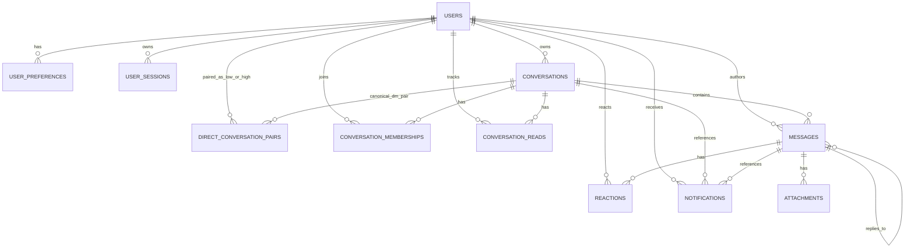

# CentrumChat Server — Historical Database Schema Snapshot

> Historical snapshot — not current implementation. It predates migrations after 0006;
> current schema truth is `db/migrations/`, `src/storage/db.ts`, and repository code.

This document describes the current post-migration SQLite schema after
`0006_attachment_ownership_and_security_foundation.sql`.

## 1. Current database overview

- Engine: SQLite via `node:sqlite`
- Database file: `DATABASE_PATH` in `src/shared/config/config.ts` (default `./data/centrumchat.sqlite`)
- Connection setup: `src/storage/db.ts` opens a single `DatabaseSync`, enables `PRAGMA journal_mode = WAL`, and turns on `PRAGMA foreign_keys = ON`
- Migration mechanism: numbered SQL files under `db/migrations/`, applied in order at boot and recorded in `schema_migrations`
- Transaction mechanism: `withTransaction(db, fn)` wraps explicit `BEGIN` / `COMMIT` / `ROLLBACK`
- Test strategy: temporary SQLite files created per test case in `tests/support/testDatabase.ts`

## 2. Current table inventory

### `users`

| Column | Type | Nullable | Default / constraint | Notes |
|---|---|---:|---|---|
| `id` | `TEXT` | no | PK | UUIDv4 generated by storage |
| `username` | `TEXT` | no | `UNIQUE` | Login identifier |
| `display_name` | `TEXT` | no |  | Display label |
| `email` | `TEXT` | no | `UNIQUE` | Registration/login identifier |
| `password_hash` | `TEXT` | no |  | Argon2/WebCrypto hash |
| `bio` | `TEXT` | no | `''` | Profile bio |
| `avatar_seed` | `TEXT` | yes |  | Generated avatar seed |
| `avatar_url` | `TEXT` | yes |  | Custom avatar file URL |
| `cover_index` | `INTEGER` | no | `0` | Cover selection index |
| `cover_url` | `TEXT` | yes |  | Custom cover file URL |
| `name_color` | `TEXT` | yes |  | Optional accent color |
| `status` | `TEXT` | no | `CHECK (online,idle,dnd,offline)` default `offline` | Presence state |
| `last_seen_at` | `TEXT` | yes |  | Last disconnect timestamp |
| `is_premium` | `INTEGER` | no | `0` | Boolean-like flag |
| `messages_sent` | `INTEGER` | no | `0` | Counter |
| `reactions_added` | `INTEGER` | no | `0` | Counter |
| `replies_made` | `INTEGER` | no | `0` | Counter |
| `created_at` | `TEXT` | no | timestamp default | ISO-8601 UTC |
| `updated_at` | `TEXT` | no | timestamp default | ISO-8601 UTC |

### `user_preferences`

| Column | Type | Nullable | Default / constraint | Notes |
|---|---|---:|---|---|
| `user_id` | `TEXT` | no | PK, FK `users(id)` `ON DELETE CASCADE` | One row per user |
| `sound_enabled` | `INTEGER` | no | `1` | Boolean-like |
| `desktop_notifications` | `INTEGER` | no | `0` | Boolean-like |
| `dm_privacy` | `TEXT` | no | `CHECK (everyone,group_members,no_one)` default `everyone` | DM privacy policy |
| `group_privacy` | `TEXT` | no | `CHECK (everyone,dm_contacts,no_one)` default `everyone` | Group invite policy |
| `theme` | `TEXT` | no | `CHECK (dark,light)` default `dark` | UI preference |

### `user_sessions`

| Column | Type | Nullable | Default / constraint | Notes |
|---|---|---:|---|---|
| `id` | `TEXT` | no | PK | Session row id |
| `user_id` | `TEXT` | no | FK `users(id)` `ON DELETE CASCADE` | Owning user |
| `refresh_token_hash` | `TEXT` | no | `UNIQUE` | SHA-256 of refresh token |
| `device_label` | `TEXT` | yes |  | Optional device label |
| `issued_at` | `TEXT` | no | timestamp default | Creation time |
| `expires_at` | `TEXT` | no |  | Absolute expiry |
| `revoked_at` | `TEXT` | yes |  | Revocation timestamp |

### `direct_conversation_pairs`

| Column | Type | Nullable | Default / constraint | Notes |
|---|---|---:|---|---|
| `conversation_id` | `TEXT` | no | PK, FK `conversations(id)` `ON DELETE CASCADE` | Canonical DM conversation |
| `user_low_id` | `TEXT` | no | FK `users(id)` `ON DELETE CASCADE`, `CHECK (user_low_id < user_high_id)` | Lower-sorted user id |
| `user_high_id` | `TEXT` | no | FK `users(id)` `ON DELETE CASCADE`, `UNIQUE (user_low_id, user_high_id)` | Higher-sorted user id |
| `created_at` | `TEXT` | no | timestamp default | ISO-8601 UTC |

### `conversations`

| Column | Type | Nullable | Default / constraint | Notes |
|---|---|---:|---|---|
| `id` | `TEXT` | no | PK | UUID |
| `type` | `TEXT` | no | `CHECK (channel,group,dm)` | Conversation type |
| `slug` | `TEXT` | yes | `UNIQUE (type, slug)` | Used by channels |
| `name` | `TEXT` | yes |  | Display name |
| `topic` | `TEXT` | yes |  | Topic/description |
| `owner_id` | `TEXT` | yes | FK `users(id)` | Owner for groups |
| `is_public` | `INTEGER` | no | `0` | Boolean-like |
| `created_at` | `TEXT` | no | timestamp default | ISO-8601 UTC |

### `conversation_memberships`

| Column | Type | Nullable | Default / constraint | Notes |
|---|---|---:|---|---|
| `conversation_id` | `TEXT` | no | PK part, FK `conversations(id)` `ON DELETE CASCADE` | Membership scope |
| `user_id` | `TEXT` | no | PK part, FK `users(id)` `ON DELETE CASCADE` | Member user |
| `role` | `TEXT` | no | `CHECK (owner,moderator,member)` default `member` | Membership role |
| `joined_at` | `TEXT` | no | timestamp default | Join time |

### `conversation_reads`

| Column | Type | Nullable | Default / constraint | Notes |
|---|---|---:|---|---|
| `conversation_id` | `TEXT` | no | PK part, FK `conversations(id)` `ON DELETE CASCADE` | Read scope |
| `user_id` | `TEXT` | no | PK part, FK `users(id)` `ON DELETE CASCADE` | Reader |
| `last_read_message_id` | `TEXT` | yes | FK `messages(id)` | Read marker |
| `updated_at` | `TEXT` | no | timestamp default | Marker timestamp |

### `messages`

| Column | Type | Nullable | Default / constraint | Notes |
|---|---|---:|---|---|
| `id` | `TEXT` | no | PK | Message id |
| `conversation_id` | `TEXT` | no | FK `conversations(id)` `ON DELETE CASCADE` | Owning conversation |
| `author_id` | `TEXT` | yes | FK `users(id)` | System messages are null-authored |
| `content` | `TEXT` | no |  | Message body |
| `reply_to_id` | `TEXT` | yes | FK `messages(id)` `ON DELETE SET NULL` | Reply target |
| `is_system` | `INTEGER` | no | `0` | Boolean-like |
| `edited_at` | `TEXT` | yes |  | Edit timestamp |
| `deleted_at` | `TEXT` | yes |  | Soft-delete timestamp |
| `created_at` | `TEXT` | no | timestamp default | ISO-8601 UTC |

### `reactions`

| Column | Type | Nullable | Default / constraint | Notes |
|---|---|---:|---|---|
| `message_id` | `TEXT` | no | PK part, FK `messages(id)` `ON DELETE CASCADE` | Target message |
| `user_id` | `TEXT` | no | PK part, FK `users(id)` `ON DELETE CASCADE` | Reactor |
| `emoji` | `TEXT` | no | PK part | Reaction glyph |
| `created_at` | `TEXT` | no | timestamp default | ISO-8601 UTC |

### `attachments`

| Column | Type | Nullable | Default / constraint | Notes |
|---|---|---:|---|---|
| `id` | `TEXT` | no | PK | Attachment id |
| `message_id` | `TEXT` | yes | FK `messages(id)` `ON DELETE CASCADE` | Null until attached |
| `uploader_id` | `TEXT` | yes | FK `users(id)` `ON DELETE SET NULL` | Upload owner, backfilled where derivable |
| `file_name` | `TEXT` | no |  | Original file name |
| `mime_type` | `TEXT` | no |  | MIME type |
| `size_bytes` | `INTEGER` | no |  | File size |
| `storage_path` | `TEXT` | no |  | Relative path under `MEDIA_ROOT` |
| `created_at` | `TEXT` | no | timestamp default | ISO-8601 UTC |
| `kind` | `TEXT` | no | default `attachment` | `attachment`, `avatar`, or `cover` by convention |

### `notifications`

| Column | Type | Nullable | Default / constraint | Notes |
|---|---|---:|---|---|
| `id` | `TEXT` | no | PK | Notification id |
| `user_id` | `TEXT` | no | FK `users(id)` `ON DELETE CASCADE` | Recipient |
| `type` | `TEXT` | no |  | App-level enum (`mention`, `dm`, `group_invite`, `reaction`) |
| `conversation_id` | `TEXT` | yes | FK `conversations(id)` `ON DELETE CASCADE` | Related conversation |
| `message_id` | `TEXT` | yes | FK `messages(id)` `ON DELETE CASCADE` | Related message |
| `payload_json` | `TEXT` | yes |  | Serialized metadata |
| `is_read` | `INTEGER` | no | `0` | Boolean-like |
| `created_at` | `TEXT` | no | timestamp default | ISO-8601 UTC |

### `schema_migrations`

| Column | Type | Nullable | Default / constraint | Notes |
|---|---|---:|---|---|
| `version` | `INTEGER` | no | PK | Migration number |
| `name` | `TEXT` | no |  | Migration file stem |
| `applied_at` | `TEXT` | no | timestamp default | ISO-8601 UTC |

## 3. Current foreign keys

- `user_preferences.user_id` → `users.id` `ON DELETE CASCADE`
- `user_sessions.user_id` → `users.id` `ON DELETE CASCADE`
- `direct_conversation_pairs.conversation_id` → `conversations.id` `ON DELETE CASCADE`
- `direct_conversation_pairs.user_low_id` → `users.id` `ON DELETE CASCADE`
- `direct_conversation_pairs.user_high_id` → `users.id` `ON DELETE CASCADE`
- `conversations.owner_id` → `users.id`
- `conversation_memberships.conversation_id` → `conversations.id` `ON DELETE CASCADE`
- `conversation_memberships.user_id` → `users.id` `ON DELETE CASCADE`
- `conversation_reads.conversation_id` → `conversations.id` `ON DELETE CASCADE`
- `conversation_reads.user_id` → `users.id` `ON DELETE CASCADE`
- `conversation_reads.last_read_message_id` → `messages.id`
- `messages.conversation_id` → `conversations.id` `ON DELETE CASCADE`
- `messages.author_id` → `users.id`
- `messages.reply_to_id` → `messages.id` `ON DELETE SET NULL`
- `reactions.message_id` → `messages.id` `ON DELETE CASCADE`
- `reactions.user_id` → `users.id` `ON DELETE CASCADE`
- `attachments.message_id` → `messages.id` `ON DELETE CASCADE`
- `attachments.uploader_id` → `users.id` `ON DELETE SET NULL`
- `notifications.user_id` → `users.id` `ON DELETE CASCADE`
- `notifications.conversation_id` → `conversations.id` `ON DELETE CASCADE`
- `notifications.message_id` → `messages.id` `ON DELETE CASCADE`

## 4. Current indexes

- `idx_messages_conversation_created(conversation_id, created_at)`
- `idx_messages_reply_to(reply_to_id)`
- `idx_conversation_memberships_user(user_id)`
- `idx_conversation_reads_user(user_id)`
- `idx_reactions_message(message_id)`
- `idx_attachments_message(message_id)`
- `idx_attachments_uploader(uploader_id)`
- `idx_notifications_user_unread(user_id, is_read)`
- `idx_user_sessions_user(user_id)`
- `direct_conversation_pairs` relies on its table-level `UNIQUE (user_low_id, user_high_id)` constraint rather than a separate named index.

## 5. Mermaid ER diagram

## 6. Domain terminology

- Conversation: the shared message container for channel, group, and DM modes
- Conversation membership: a persisted participant relationship, used for groups and DMs, plus sparse channel moderator rows
- Conversation read state: the per-user last-read marker for a conversation
- User session: the stored refresh-token hash record backing login/refresh/logout

## 7. Session persistence behavior

- Login and registration create a new `user_sessions` row.
- The client credential is still called a refresh token, but only `refresh_token_hash` is persisted.
- Refresh-token rotation revokes the previous row and inserts a new one.
- Logout revokes the matching row if it is still active.
- `AuthService.cleanupExpiredAndRevoked(nowIso, revokedBeforeIso)` delegates to the repository cleanup method for expired or aged-revoked rows.

## 8. Migration compatibility notes

- Historical migrations still mention the old names because they are part of database history.
- The current live schema uses `conversations`, `conversation_memberships`, `conversation_reads`, and `user_sessions`.
- DM uniqueness now lives in `direct_conversation_pairs`, which stores one canonical low/high user-id pair per DM conversation.
- Attachment ownership now lives in `attachments.uploader_id`; legacy rows are backfilled from
  message authors and avatar/cover URL ownership where that data already existed.
- The integrated frontend/backend currently exchange `conversationId` at the wire boundary for message-scoped actions.
- `room.updated` / `room.markRead` remain event names for compatibility; the payload field is `conversationId`.

## 9. Remaining application-only invariants

- A DM conversation should have exactly two memberships; the database does not enforce the exact count.
- A DM conversation should have exactly one canonical user pair row in `direct_conversation_pairs`; the creation workflow and migration validate the exact two-member shape.
- Channel access remains application-level public access; membership rows are not required for ordinary reads or writes.
- `conversation_reads.last_read_message_id` is not constrained to belong to the same conversation.
- Some legacy `attachments` rows may still have `uploader_id IS NULL` if no authoritative owner
  could be derived during backfill; new writes always set it.
- `notifications.type` and `attachments.kind` are enum-like by convention, not by database check constraint.
- `is_premium`, `is_public`, `is_system`, `is_read`, and other boolean-like integers are enforced by application code and conventions, not by extra `CHECK` constraints in the current schema.

## 10. Known future extension points

- Purging expired/revoked sessions on a schedule
- Tightening additional enum/boolean database checks if a future migration justifies table rebuilds
- Stronger conversation-level unread projections if message volume grows substantially
- Additional moderation or audit tables, if product scope expands
- Full-text search tables or external search integration if message search becomes a hotspot
